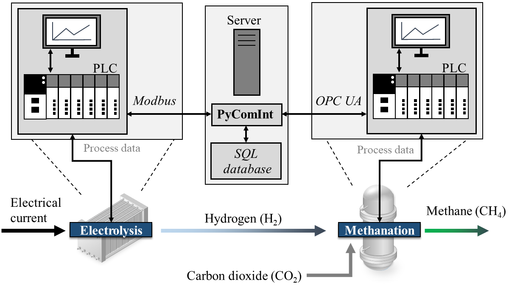

# PyComInt

Python communication interface for technical processes and chemical plants with different process units for control, monitoring, and data storage.

---

## Table of Contents

1. [Overview](#overview)
2. [Project Structure](#features)
3. [Installation and Usage](#installation)
4. [Requirements](#requirements)
5. [Contributing](#contributing)
6. [License](#license)
7. [Citing](#citing)

---

## Overview

**PyComInt** is a communication interface designed for technical production processes. It facilitates multi-threaded data transfer between an **OPC UA server**, a **Modbus client**, and an **SQL database**. Due to implementation of try-except error handling, the code moreover ensures stable operation of the different functions, even if one connection fails. It has been designed for a Windows system, but can also be deployed on a LINUX system (e.g. by using a Docker container).

### Application

PyComInt has been applied to a **Power-to-Gas** process, integrating:
- A **proton exchange membrane electrolyzer (PEMEL)** with a programmable logic controller (PLC) providing Modbus client.
- A **methanation unit (METH)** with a PLC providing an OPC UA server.
- A **PostgreSQL database** for data storage



The communication interface enables the reliable connection of the process units, PEMEL control, and data storage. With respect to this setup, the code operation comprises three different tasks:

1. **PEMEL control**: Since the PLC of METH computes and determines the required hydrogen flow rate for methane synthesis, the code connects PEMEL to METH via Modbus and OPC UA. The set point for the hydrogen flow rate is converted to the respective electrical current of the PEMEL using a experimental data correlating these values. The PEMEL control task is performed with high frequency (here, every second)
2. **Data storage**: To store the data of PEMEL and METH, the code connects PEMEL via Modbus and METH via OPC UA with PostgreSQL and inserts the process data into the database. Because of the relatively slow process dynamics of METH, the data storage task is performed less frequently (here, every 10 seconds)
3. **Supervision**: If the connection of one of the hardware components has failed, the code maintains the other services and tries to reconnect to the corresponding server or client (e.g. if the Modbus connection fails, it still performs data storage of METH). 

This tool supports efficient data management and process control in industrial applications by ensuring reliable communication between different system components. The present application example contains only two process units and a database, but it can be extended to far more components following the structure below.

---

## Project Structure

The project is organized into the following directories and files:

```plaintext
PyComInt/
│
├── config/
│   ├── config_gen.yaml
│   ├── config_modbus.yaml
│   ├── config_opcua.yaml
│   └── config_sql.yaml
│
├── src/
│   ├── pci_modbus.py
│   ├── pci_opcua.py
│   ├── pci_sql.py
│   └── threads.py
│
├── pci_main.py
├── pci_main_ws.py
├── PEMEL_Current_H2Flowrate.txt
├── PyComInt.log
└── requirements.txt

```

### `config/`
Contains configuration files for various components of the project:
- **`config/config_gen.yaml`**: General configuration for main connection tasks and logging.
- **`config/config_modbus.yaml`**: Configuration for the Modbus client, including details for decrypting bit-wise signals.
- **`config/config_opcua.yaml`**: Configuration for the OPC UA server and tagged nodes.
- **`config/config_sql.yaml`**: Configuration for the SQL database (PostgreSQL).

### `src/`
Contains source code for the different threads and connection wrappers using object-oriented programming:
- **`src/pci_modbus.py`**: Implements the Modbus connection with a class object providing:
  - `connect()`: Connects to the Modbus client
  - `is_connected()`: Tests the Modbus connection
  - `read_pemel_status()`: Reads and interprets the Modbus register containing the current state of PEMEL using `convert_bits()`
  - `read_pemel_process_values()`: Reads the PEMEL process values using `convert_process_values()`
  - `convert_bits()`: Converts the binary signal of the bit-wise PEMEL state representation into a one-hot encoded array
  - `convert_process_values()`: Converts the process values in the different registers to an array
  - `write_pemel_current()`: Writes the set point of the PEMEL electrical current to the respective Modbus register using `convert_h2_flow_to_current()`
  - `convert_h2_flow_to_current()`: Converts the hydrogen flow rate to the PEMEL's electrical current using `interpolate_h2_flow()`
  - `interpolate_h2_flow()`: Determines the electrical current based on the experimental values in `PEMEL_Current_H2Flowrate.txt`
- **`src/pci_opcua.py`**: Implements the OPC UA connection with a class object providing:
  - `connect()`: Connects to the OPC UA server
  - `is_connected()`: Tests the OPC UA connection
  - `read_node_values()`: Reads the values of multiple nodes using their NodeIDs
- **`src/pci_sql.py`**: Implements the SQL connection with a class object providing:
  - `connect()`: Connects to the SQL database
  - `is_connected()`: Tests the SQL connection
  - `insert_data()`: Inserts data into PostgreSQL database
- **`src/threads.py`**: Implements multi-threaded operations, including:
  - **PEMEL control thread** > `pemel_control()`: Manages PEMEL operations using Modbus and OPC UA using `el_control_func()`
  - **Data storage thread** > `data_storage()`: Handles data transfer between the OPC UA server, Modbus client, and SQL database using `data_trans_func()`
  - **Supervisor thread** > `supervisor()`: Monitors and attempts reconnection for disconnected services.

### Main Scripts
- **`pci_main.py`**: The primary script for running multi-threaded data transfer operations.
- **`pci_main_ws.py`**: A variation of the main script designed to set up a Windows service for data transfer.

### Miscellaneous
- **`PEMEL_Current_H2Flowrate.txt`**: Contains the PEMEL hydrogen production depending on the applied electrical current.
- **`PyComInt.log`**: Contains the log for debugging and monitoring, will be created when running the code.
- **`requirements.txt`**: Contains the required python libraries.


---

## Installation and Usage

The following steps describe the installation procedure on a Windows system:

```bash
# Clone the repository
git clone https://github.com/SimMarkt/PyComInt.git

# Navigate to the project directory
cd PyComInt

# Create a Python virtual environment
python -m venv venv

# Activate the virtual environment
.\venv\Scripts\activate

# Install the required python libraries
pip install -r requirements.txt

```

After installing the python environment with its necessary packages, the configuration needs to be adjusted to the specific plant setup. The following points outline the usage of the communication interface: 

1. Configure the project using the YAML files located in the `config/` directory. (Ensure that the different servers and clients are accessible)
2. Run `pci_main.py` for a standard multi-threaded data transfer operation. (On Windows, it can further be tested for continuous deployment using the Windows Task Scheduler)
3. Optionally, set up `pci_main_ws.py` as a Windows service for seamless background execution.
4. The code also creates a log file `PyComInt.log` for debugging and monitoring. 

---

## Requirements

- Python 3.8+
- Required libraries:
  - `pymodbus`
  - `opcua`
  - `PyYAML`
  - `pywin32`
  - `cryptography`
  - `pg8000`

To avoid any version conflicts, it is recommended to use the libraries given in `requirements.txt`. 

---

## License

This project is licensed under the [MIT License](LICENSE).
